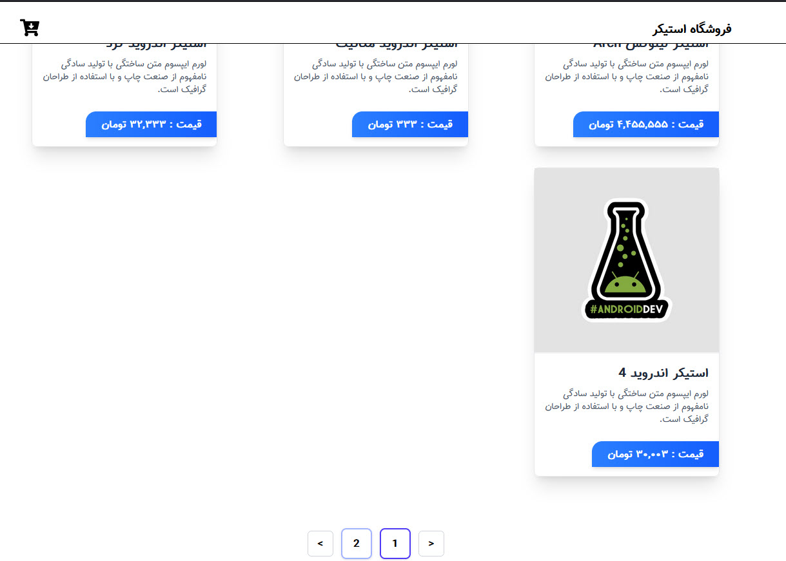

# فروشگاه استیکر با Redux Toolkit (RTK)



یک فروشگاه مدرن استیکر ساخته شده با React، Redux Toolkit (RTK) و ویژگی‌های پیشرفته صفحه‌بندی.

## ویژگی‌ها

- 🛍️ مرور و خرید استیکر
- 🔄 مدیریت state با Redux Toolkit (RTK)
- 📄 صفحه‌بندی برای تجربه کاربری بهتر
- 🎨 طراحی مدرن و واکنش‌گرا
- 🛒 قابلیت سبد خرید
- 💳 فرآیند پرداخت

## تکنولوژی‌های استفاده شده

- React
- Redux Toolkit (RTK)
- Vite
- React Router
- Styled Components

## شروع به کار

1. کلون کردن مخزن:

```bash
git clone https://github.com/your-username/sticker-shop.git
```

2. نصب وابستگی‌ها:

```bash
npm install
```

3. اجرای سرور توسعه:

```bash
npm run dev
```

## ساختار پروژه

```
src/
├── components/
├── features/
│   └── cart/
│   └── products/
├── store/
├── pages/
└── assets/
```

## مشارکت

درخواست‌های pull مورد استقبال قرار می‌گیرند. برای تغییرات عمده، لطفاً ابتدا یک issue باز کنید تا در مورد تغییراتی که می‌خواهید ایجاد کنید بحث کنیم.

## مجوز

MIT
